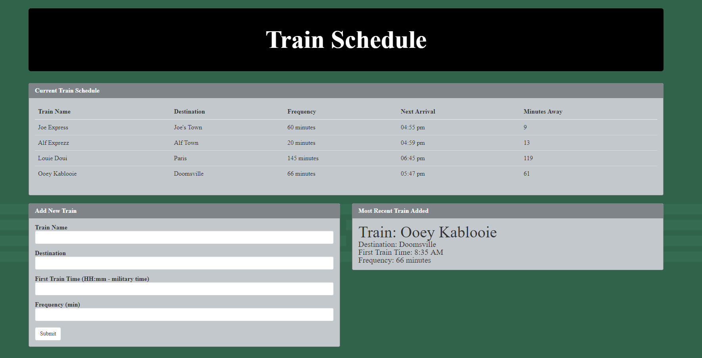
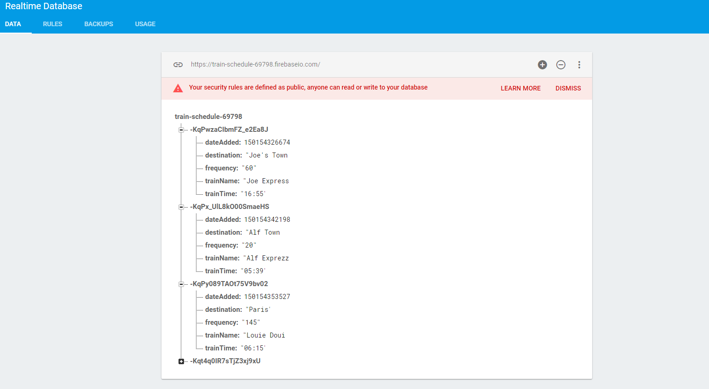

<h1 align="center">Train-Scheduler</h1>

<h2>Info:</h2>

This web application allows you to create a train schedule using the Google Firebase

It also uses the Moment.JS to grab actual time zone and determine when the next train would arrive LIVE!

<h2>Main Page<h2>

    

<h2>Firebase Data<h2>

    

<h3>Technologies used</h3>

<ul>
    <li><strong>HTML</strong></li>
    <li><strong>CSS - Bootstrap</strong></li>
    <li><strong>Javascript</strong></li>
    <li><strong>JQUERY</strong></li>
    <li><strong>Moment.JS</strong></li>
    <li><strong>Database - Google Firebase</strong></li>
    
</ul>

<h3>Check it out!</h3>

<ul>
    <li><strong>https://alrod909.github.io/Train-Scheduler/</strong></li>
</ul>
